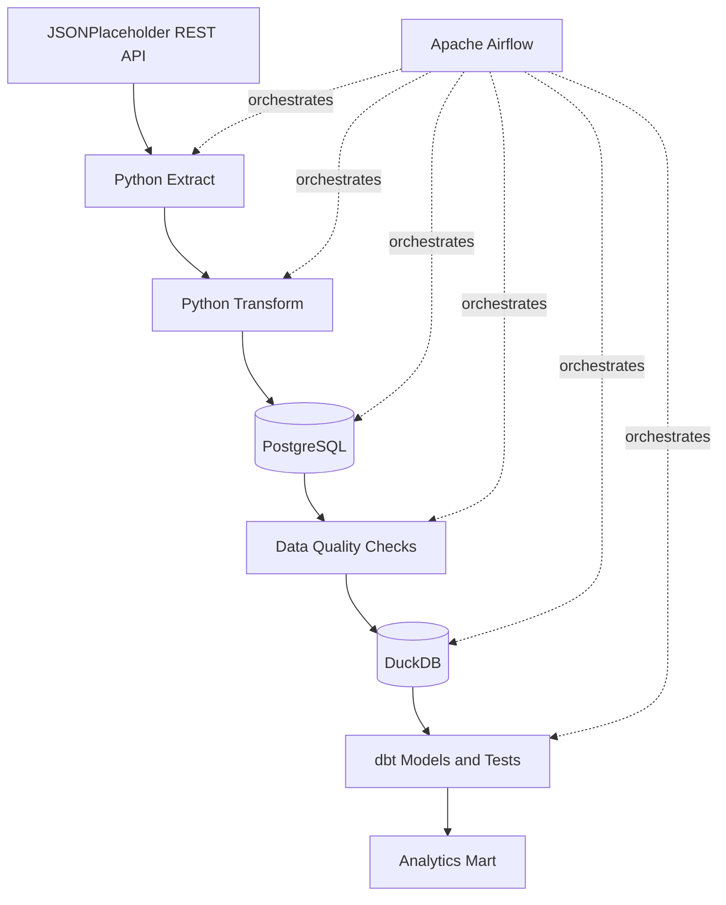

# Data Engineering ETL Pipeline


Учебный Data Engineering-проект, демонстрирующий полный ETL-пайплайн: получение данных из REST API, преобразование, загрузку в PostgreSQL, проверки качества, создание аналитического слоя в DuckDB и трансформации с помощью dbt.

Оркестрация выполняется Apache Airflow, а качество кода автоматически проверяется через GitHub Actions.

## Architecture



## Pipeline Flow

1. Данные `users` и `posts` загружаются из JSONPlaceholder REST API.
2. Ответы API сохраняются в raw JSON-файлы.
3. Python преобразует JSON в очищенные табличные данные.
4. Данные загружаются в PostgreSQL с использованием UPSERT.
5. Выполняются проверки качества данных:
   - таблицы не пустые;
   - обязательные поля не содержат `NULL`;
   - все посты связаны с существующими пользователями.
6. Данные копируются из PostgreSQL в DuckDB.
7. dbt создаёт staging-модели и аналитическую витрину `posts_by_user`.
8. Airflow управляет всей последовательностью задач.

## Technology Stack

- Python
- Apache Airflow
- PostgreSQL
- DuckDB
- dbt Core
- Pandas
- Psycopg
- Docker Compose
- Pytest
- Ruff
- GitHub Actions
- Make

## Project Structure

```text
airflow-airbyte-lab/
├── .github/
│   └── workflows/
│       └── tests.yml
│
├── dags/
│   ├── api_etl_taskflow.py
│   └── hello_airflow.py
│
├── dbt/
│   └── analytics/
│       ├── models/
│       │   ├── staging/
│       │   └── marts/
│       └── dbt_project.yml
│
├── etl/
│   ├── config.py
│   ├── extract.py
│   ├── load.py
│   ├── load_postgres.py
│   ├── logger.py
│   ├── postgres.py
│   ├── quality.py
│   ├── transform.py
│   └── validation.py
│
├── sql/
│   └── create_postgres_tables.sql
│
├── tests/
├── data/
├── docker-compose.yml
├── Makefile
├── pyproject.toml
├── .env.example
└── README.md
```

## Data Model

### Raw tables

#### `users`

| Column | Description |
|---|---|
| `id` | User identifier |
| `name` | Full name |
| `username` | Username |
| `email` | Email address |

#### `posts`

| Column | Description |
|---|---|
| `id` | Post identifier |
| `user_id` | Reference to user |
| `title` | Post title |
| `body` | Post body |

### dbt models

#### `stg_users`

Очищенная модель пользователей с нормализованным email.

#### `stg_posts`

Очищенная модель постов с вычисленными длинами заголовка и текста.

#### `posts_by_user`

Аналитическая витрина на уровне пользователя:

- количество постов;
- средняя длина заголовка;
- средняя длина текста поста.

## Requirements

- macOS or Linux
- Docker Desktop
- Miniforge or Conda
- Python
- Make

В проекте используются три окружения:

```text
analytics
airflow-lab
dbt-lab
```

## Configuration

Создай локальный `.env`:

```bash
cp .env.example .env
```

Пример переменных:

```env
API_BASE_URL=https://jsonplaceholder.typicode.com
API_RESOURCES=users,posts

POSTGRES_HOST=localhost
POSTGRES_PORT=5432
POSTGRES_DB=etl
POSTGRES_USER=etl
POSTGRES_PASSWORD=etl

DATABASE_NAME=warehouse.duckdb
```

Файл `.env` не должен попадать в Git.

## Available Commands

Посмотреть все команды:

```bash
make help
```

### Infrastructure

Запустить PostgreSQL и Adminer:

```bash
make docker-up
```

Остановить:

```bash
make docker-down
```

Adminer доступен по адресу:

```text
http://localhost:8081
```

### Full ETL pipeline

```bash
make etl
```

Команда выполняет:

```text
extract
→ transform
→ PostgreSQL load
→ quality checks
→ DuckDB load
→ dbt build
```

### Airflow

Запуск:

```bash
make airflow-start
```

Airflow UI:

```text
http://localhost:8080
```

Остановка:

```bash
make airflow-stop
```

Основной DAG:

```text
api_etl_taskflow
```

### dbt

Проверка конфигурации:

```bash
make dbt-debug
```

Запуск моделей:

```bash
make dbt-run
```

Запуск тестов:

```bash
make dbt-test
```

Запуск моделей и тестов:

```bash
make dbt-build
```

Генерация документации:

```bash
make dbt-docs-generate
```

Запуск документации:

```bash
make dbt-docs-serve
```

dbt Docs будут доступны по адресу:

```text
http://localhost:8082
```

### Python tests and code quality

```bash
make format
make check
```

`make check` запускает:

```text
Ruff lint
Ruff format check
Pytest
```

## Automated Tests

Проект содержит тесты для:

- трансформации пользователей;
- трансформации постов;
- загрузки DataFrame в DuckDB;
- вспомогательных функций качества данных;
- проверки структуры и логики ETL.

## Continuous Integration

GitHub Actions запускается при:

- push в `main`;
- push в ветки `feature/**`;
- Pull Request в `main`.

CI выполняет:

```text
Ruff lint
Ruff format check
Pytest
dbt debug
dbt compile
```

## Development Workflow

Для новых изменений используется feature-ветка:

```bash
git switch -c feature/new-feature
```

Перед коммитом:

```bash
make format
make check
make etl
```

Затем:

```bash
git add .
git commit -m "Describe the change"
git push origin feature/new-feature
```

## Future Improvements

- Airbyte integration on a more powerful machine
- Incremental dbt models
- PostgreSQL migrations
- dbt snapshots
- Data freshness checks
- Pre-commit hooks
- Monitoring and notifications
- Containerized Airflow
- Cloud deployment

## License

This project is licensed under the MIT License.